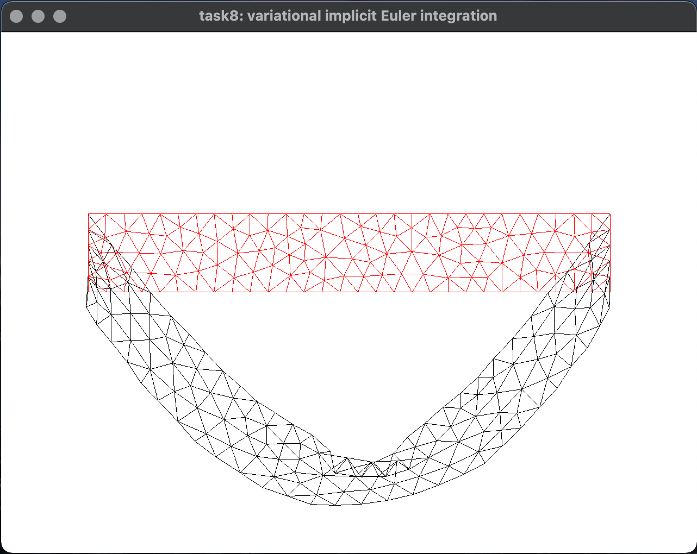
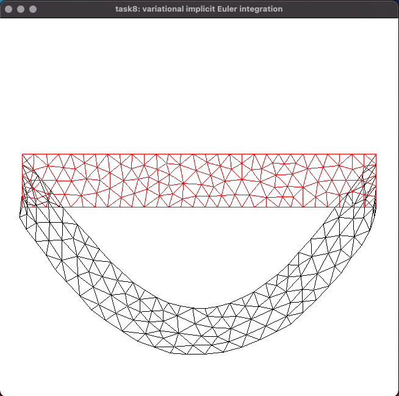
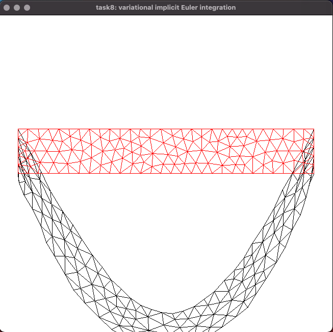
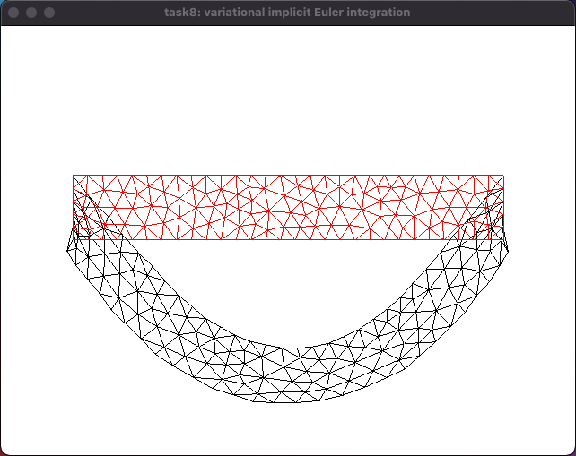

# Task8: Variational Time Integration 

**Deadline: June 24th (Thursday) at 15:00pm**


## Setting Up

Please take a look at the following document for environment setup, creating branch, and making pull request.

- [How to Submit the Assignment](../doc/submit.md)

In this assignment, it is necessary to install [Eigen](https://eigen.tuxfamily.org/index.php?title=Main_Page) library. Please follow the following document for setting up.    

- [How to set up the Eigen Library](../doc/setup_eigen.md)  


Additionally, you need the newest version of the library [DelFEM2](https://github.com/nobuyuki83/delfem2) in `pba-<username>/3rd_party` . Please keep this library installed and updated by. 

```bash
$ cd pba-<username> # go to the top of local repository
$ git submodule update --init 3rd_party/delfem2
```

(DelFEM2 is a collection of useful C++ codes written by the instructer.)


## Problem1

Build the program using `cmake`. Run the program and take a screenshot image of the window. Paste the screenshot image below by editing this mark down document:

=== paste screenshot here ==



## Problem 2

Currently the problem minimize the energy of a mass-spring system (see [task3)](../task3). Use the **variational implicit Euler scheme** [[16]](http://www.nobuyuki-umetani.com/scribble/variational_integration.pdf) to -change the static optimization into dynamic animation. Edit the function `AnimationByEnergyMinimization`  from line 104 to 169.

The following slide may be useful :


Paste the screenshot image of the animation below:

== paste screenshot image here==




